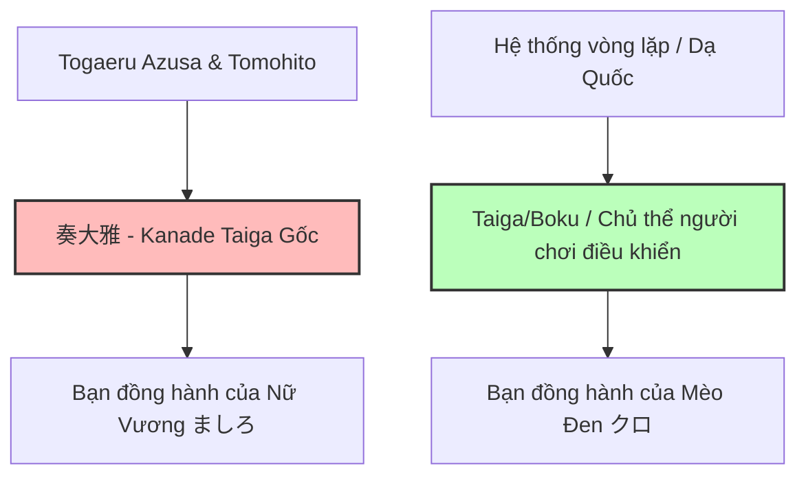
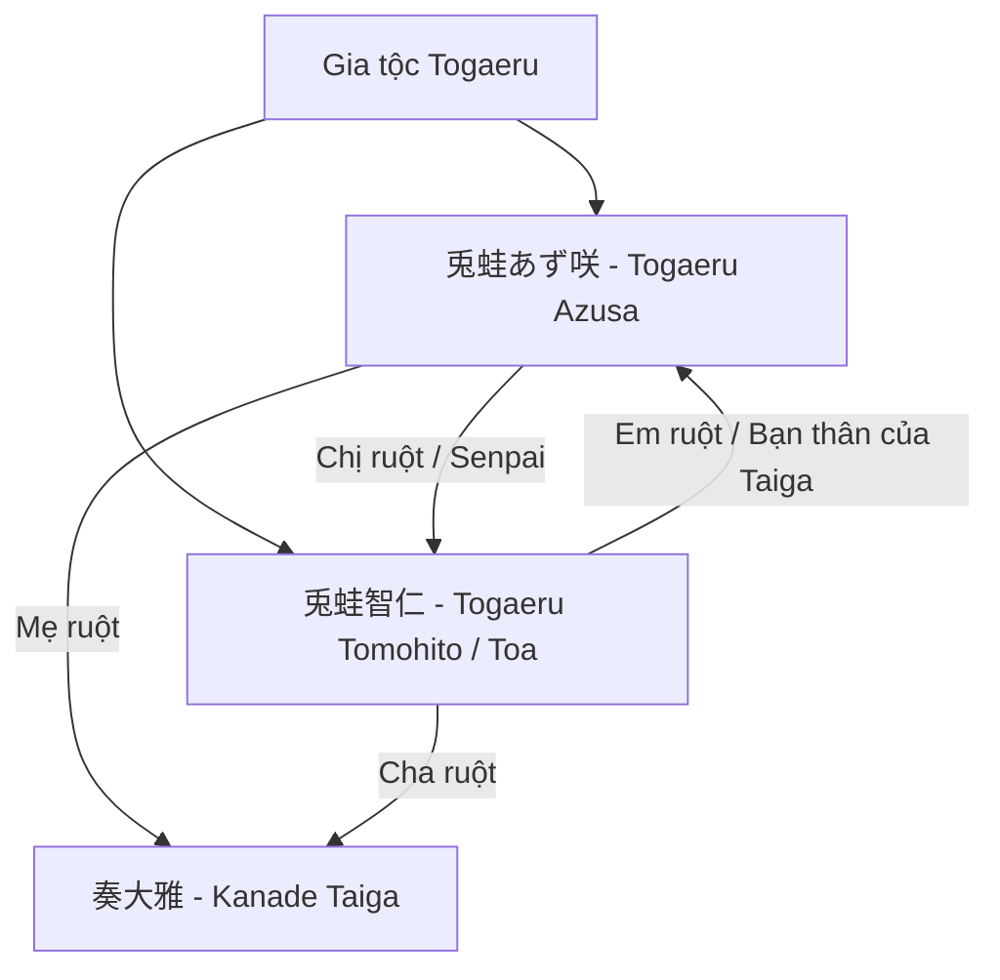

# 📖 Tài Liệu Bổ Sung Context & Cốt Truyện Deep Lore — Sakura Moyu (Bản Toàn Diện)

Tài liệu này tổng hợp toàn bộ cốt truyện nâng cao, các bí mật ẩn sâu (spoiler) và mối quan hệ huyết thống/vòng lặp thời gian phức tạp trong *Sakura, Moyu. -as the Night's, Reincarnation-*. Việc hiểu rõ các chi tiết này sẽ giúp dịch chính xác sắc thái, xưng hô và các ẩn ý trong từng lời thoại của nhân vật.

---

## 1. Bí Mật Động Trời: Trò Chơi Của "Hai Taiga"

Trong game, sự tồn tại của nhân vật chính **Taiga** thực chất được chia làm **hai thực thể khác biệt** nhưng mang cùng hình hài và tên gọi. Đây là cú lừa lớn nhất (Narrative Trick) của cốt truyện:

### 👤 奏大雅 (Kanade Taiga - Bản Gốc)
* **Thân phận thật sự:** Con trai ruột của Togaeru Azusa và Togaeru Tomohito.
* **Vai trò trong cốt truyện:** 
  - Là người bạn đồng hành, là tình yêu của **Nữ Vương Mashiro (ましろ)** ở quá khứ/dòng thời gian gốc. 
  - Anh là người đã cùng Mashiro trải qua những biến cố ban đầu và đóng vai trò như chiếc chìa khóa định hình nên Dạ Quốc thời kỳ đầu.
  - Khi game nói về mối quan hệ huyết thống trực hệ của gia tộc Togaeru, người được nhắc đến chính là Kanade Taiga bản gốc này.

### 👤 大雅 (Taiga / "Boku" - Nhân Vật Chính/Người Chơi Điều Khiển)
* **Thân phận thật sự:** Là một thực thể "mô phỏng cuộc đời" (同一人物の別人 - Bản thể khác của cùng một người), được tái tạo từ vòng lặp nhân quả của Dạ Quốc.
* **Vai trò trong cốt truyện:**
  - Là nhân vật mà người chơi điều khiển từ đầu đến cuối game. Anh tự xưng là "tôi" (`Boku` / `俺`), sống tại Sangencho và làm việc tại Yume no Nedoko.
  - Anh là **bạn đồng hành/người yêu của Kuro (クロ)**. 
  - Thực chất, anh không phải là Kanade Taiga nguyên bản từng yêu Mashiro, mà là một linh hồn được tái sinh để gánh vác sứ mệnh cứu rỗi tất cả các cô gái (Haru, Hiori, Chiwa) và cuối cùng tìm thấy hạnh phúc bên Kuro ở Grand Route.

---

## 2. Gia Phả & Mối Quan Hệ Gia Tộc Togaeru (兎蛙)

* **兎蛙あず咲 (Togaeru Azusa)**: Chị ruột của Tomohito, đồng thời là mẹ ruột của Kanade Taiga. Cô mắc chứng bệnh nhảy vọt thời gian đến tương lai mỗi khi ngủ, và đã tạo ra Dạ Quốc để quay lại quá khứ cứu em trai mình.
* **兎蛙智仁 (Togaeru Tomohito / "Toa")**: Em trai của Azusa, cha ruột của Kanade Taiga. Được chị gái ban tặng tài năng âm nhạc qua ma pháp, anh là người đã sáng tác nên khúc nhạc cứu rỗi **"Sakura, Moyu"**.

---

## 3. Bí Ẩn Về Bản Chất Của "Dạ" (夜) & Dạ Quái

* **Dạ (夜 - Yoru)**: Là chiều không gian phi tuyến tính nằm song song với thực tại, nơi thời gian bị bẻ cong, cho phép người sở hữu "vé tàu" (lấy từ Trạm cuối thời gian của thần lùn Nana) nhảy qua lại giữa các thế giới để thay đổi kết cục.
* **Dạ Vương (夜王 - Yoru-ou)**: Hiện thân của tất cả oán niệm, nỗi đau và ác mộng bị đào thải từ các dòng thời gian cũ. Dịch thống nhất: **Dạ Vương** (viết hoa).
* **ましろ (Mashiro - Dạ chi Nữ Vương)**: Cô bé Nữ hoàng Dạ Quốc. Thuở nhỏ bị bạo hành và cô độc, cô chết dưới cây anh đào và được Azusa đánh thức. Mashiro đại diện cho khát khao mẫu tử và sự bao dung cứu rỗi những linh hồn trẻ thơ lạc lối.
* **Nacht (ナハト) & Sol (ソル)**: 
  - Sol là người cha đã đổi mạng lấy sự sống cho con gái, hóa thành Dạ quái. 
  - Nacht là Dạ quái khao khát hơi ấm tình người, đã nhận nuôi **Andou Chiwa (千和)** và bảo bọc cô như con gái ruột.

---

## 4. Lưu Ý Quan Trọng Cho Dịch Thuật (Translators Guidelines)

1. **Phân biệt hai Taiga trong lời thoại:**
   - Khi cốt truyện nói về quá khứ của Mashiro hoặc dòng họ Togaeru: dùng tên đầy đủ **奏大雅 (Kanade Taiga)**.
   - Khi đối thoại ngày thường hoặc nội tâm của nhân vật chính hiện tại: gọi là **Taiga** hoặc **tôi**.
2. **Quy tắc xưng hô gia đình:**
   - Phân cảnh hồi tưởng gia đình: Taiga gọi Azusa là `Mẹ / Mama` và cô gọi Taiga là `Con`.
   - Phân cảnh học đường (vòng lặp giả lập): Taiga gọi Azusa là `Senpai / Chị Azusa` và x xưng `Em`.
   - Taiga và Tomohito (Toa) x xưng bạn bè ngang hàng: `Tớ — Cậu`.
3. **Chính tả i/y (Bộ Giáo dục 1984)**:
   - Viết `i` ngắn cho âm cuối /i/ khi không đổi nghĩa: `kì lạ`, `kỉ niệm`, `kí ức`, `hi sinh`, `mĩ thuật`, `chính trị`, `chu kì`...
   - Viết `y` dài sau âm đệm `u`: `quý giá`, `thủy chung`, `huy hoàng`...
   - Tên riêng giữ nguyên truyền thống: `Lý Bôn`, `Lý Thường Kiệt`...
4. **Văn phong**: Giữ sự thuần Việt, tự nhiên. Chỉ dùng câu cú bay bổng triết lý ở phần độc thoại nội tâm hoặc lời thoại của các thực thể Dạ Quốc (Nacht, Mashiro, Nana).
